## Nombre de la aplicación web:

BajaGym

## Descripción de la temática de la web, indicando qué funcionalidad es pública y cual es privada y diferente para cada usuario:

La web es la interfaz de la aplicación del gimnasio llamado BajaGym que permite las siguientes cosas:

- Funcionalidades públicas (usuarios sin registrar):
    1. Loguear.
    2. Consultar rutinas de ejemplo.
    3. Consultar horarios clases colectivas.
    4. Darse de alta.
- Funcionalidades privadas (usuarios registrados):
    1. Consultar rutina personal.
    2. Pedir cambio rutina.
    3. Crear rutina y modificarla (entrenador).
    4. Crear clase colectiva y modificarlas (entrenador).

## Nombre y descripción de cada una de las 4 o 5 entidades principales:

- Usuario: persona que usa la aplicación (cliente o entrenador).
- Rutina: lista de ejercicios a realizar.
- Ejercicio: movimiento a realizar.
- Material: objetos que intervienen en los ejercicios.
- Clases colectivas: rutina realizada por varios usuarios.

## Descripción de las funcionalidades del servicio interno:

- Enviar notificacion a entrenadores por cambio de rutina.

## Enlace de Trello:

https://trello.com/b/hHIXMNLi/desarrolo-de-aplicaciones-distribuidas

## Diagrama de clases UML

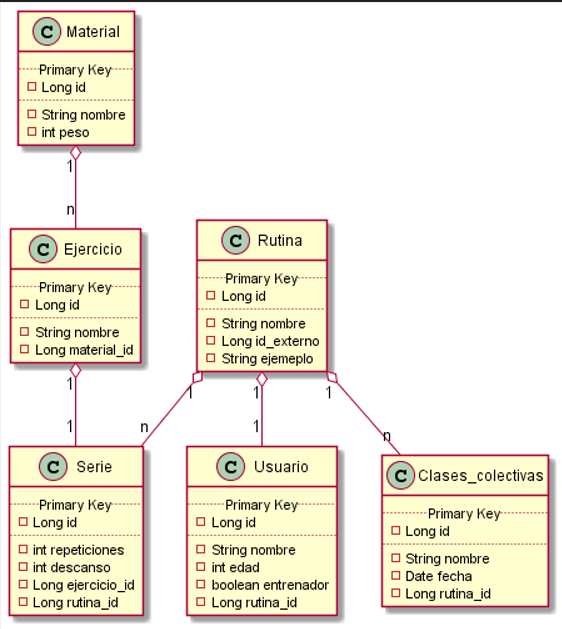

## Diagrama Entidad/relación

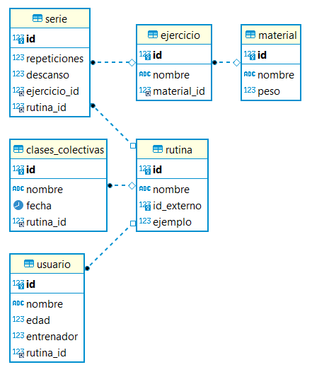

## Diagrama de clases global:
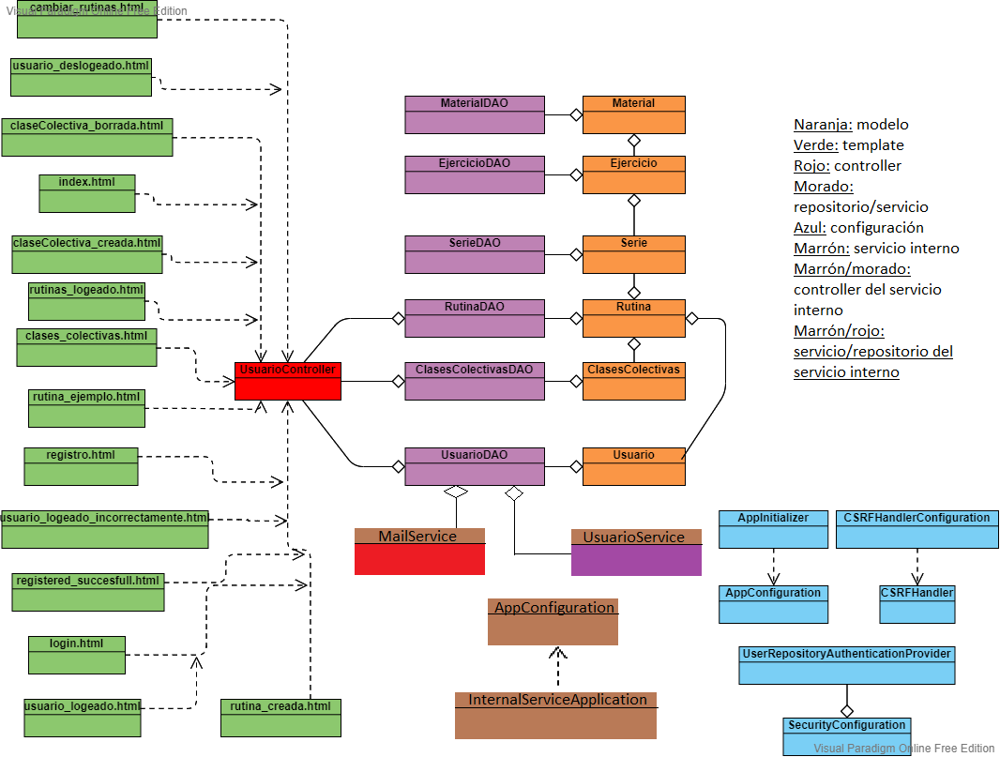

## Diagrama de navegación web

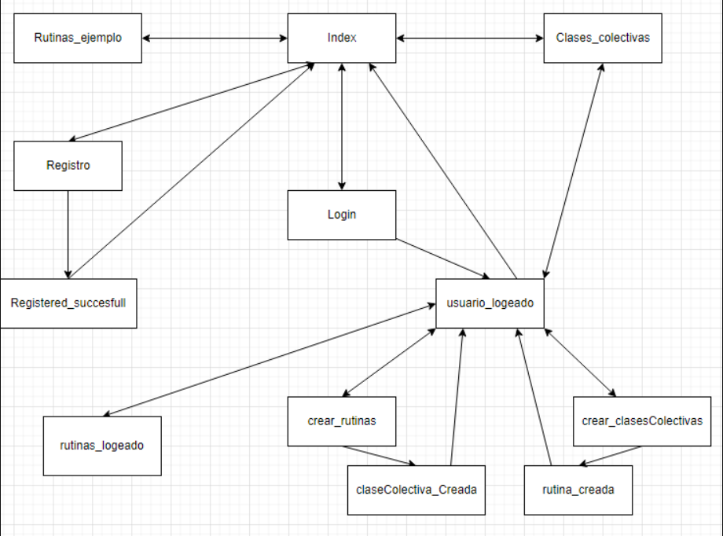

## Navegación web
-Menu principal

-Login.

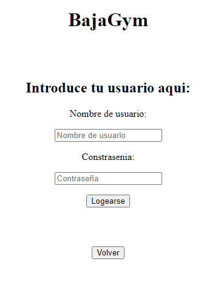

-Registro

-Página principal una vez logeado (Usuario)

-Página principal una vez logeado (Entrenador)

-Crear clases colectivas

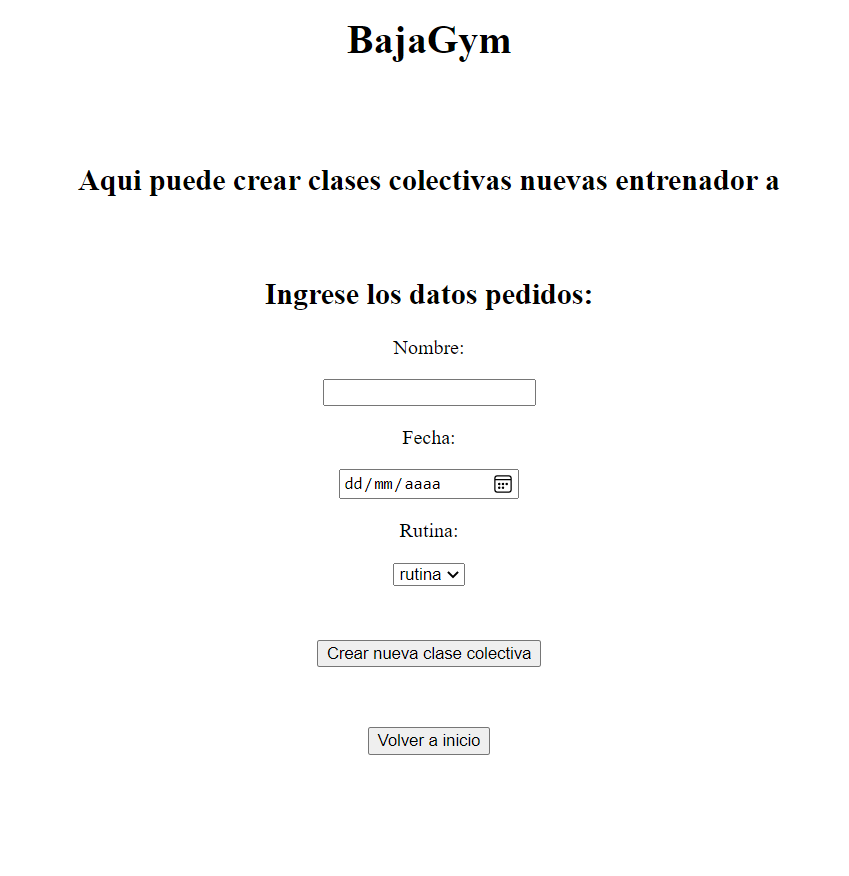

-Creada clase colectiva

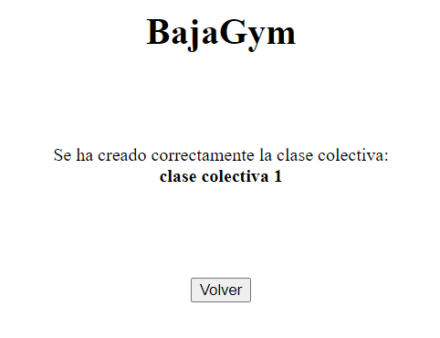

-Crear rutinas

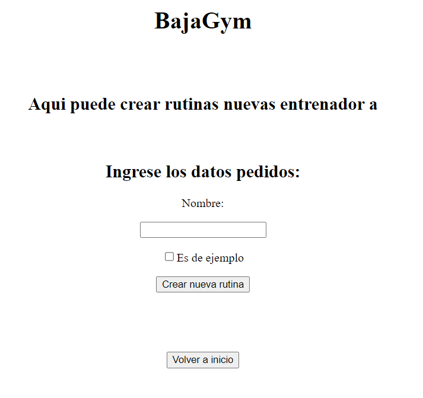

-Creada rutina

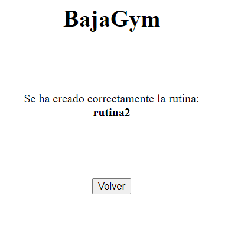

-Lista de clases colectivas (Usuario)

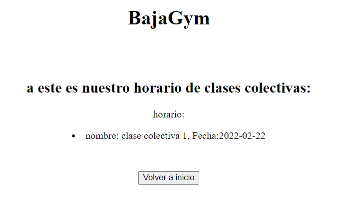

-Lista de clases colectivas (Entrenador)

-Lista de rutinas ejemplo

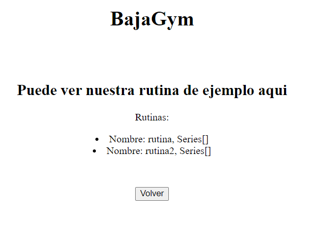

-Rutinas personales

-Cambiar rutinas

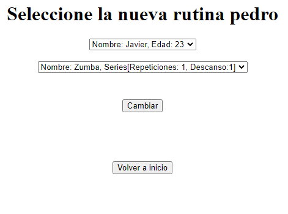

-Rutina cambiada de un usuario

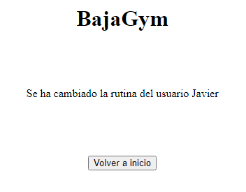

-Cambio de rutina solicitado

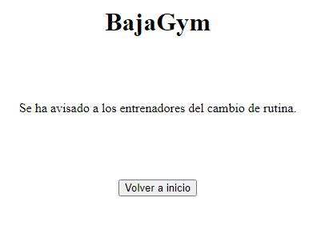

## Instrucciones instalación en VM:

- Descargar algún software de máquinas virtuales.
- Añadir una máquina virtual, en nuestro caso ubuntu.
- Instalar dicho sistema operativo con una imagen iso.
- Instalar guest additions:
  1. Se descargan las VboxAdditions para las cuales se necesita GCC (compilador de varios lenguajes que hace que aplicaciones opensource o el propio kernel funcionen con ello)
  sudo apt-get install build-essential gcc make perl dkms
  2. En caso de que se haya instalado algun sistema operativo sin entorno gráfico el paso anterior se puede saltar.
- Instalar MySql y determinar la base de datos que se va a usar, en nuestro caso dos:
  1. bajagym. BDD del servicio web.
  2. bajagyminternal. BDD del servicio interno.
  sudo apt install mysql-server
  
  Configuramos la instalación:
  1. sudo mysql_secure_installation
  2. Primero nos pedirá si queremos validar las contraseñas de los usuarios mediante un nivel de seguridad, le damos a que sí e introducimos el nivel deseado.
  3. 
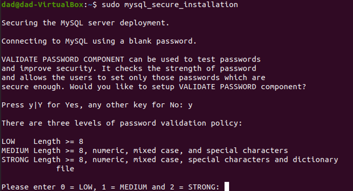
  
  3. Una vez hecho esto nos pedirá que introduzcamos una contraseña para root.
  4. A continuación nos pregunta si queremos establecer usuarios o que continue con un usuario anónimo, le damos a que no para que no nos elimine el anónimo y agilizar la instalación, ya luego introduciremos los usuarios que queramos.
     
     
  
  5. Tras este paso, nos preguntará si queremos desactivar la opción de conectarse remotamente a la BBDD y eliminamos la BDD predeterminada "test".
  6. Continuamos con la instalación predeterminada.
  7. Al terminar la instalación tenemos que hacer que "root" autentique con una contraseña y así ser capaz de usar la base de datos. Para esto, abrimos la shell de MySql y lo configuramos ahí.
  mysql -u root
     
  8. Como se puede comprobar mediante este comando, "root" se autentica mediante un auth_socket, por lo que tenemos que cambiar esto para que se autentique con una contraseña.
  Hay dos formas en MySql:
     1. mysql_native_password.
     2. caching_sha2_password.
  En nuestro caso hemos usado caching_sha2_password.
  mysql>ALTER USER 'root'@'localhost' IDENTIFIED WITH caching_sha2_password BY 'password';
  En 'password' ponemos la contraseña con la que se autenticará root.
  Actualizamos la tabla.
  mysql>FLUSH PRIVILEGES;
  Y comprobamos que se ha cambiado.
  mysql>SELECT user,authentication_string,plugin,host FROM mysql.user;
  
  
  
  9. Una vez hecho esto, ya tendriamos instalado y configurado MySql.
     
     
  
  10. Una vez configurado todo, hay que meter las tablas que se van a usar como base de datos de la aplicación principal y el servicio interno (aunque spring puede que te las cree)
  Se ha creado un script.sql que al ejecutarse se crean las tablas y mete algunos datos para que la base de datos no esté vacia.
  source "path-to-script.sql"
  11. Para que la aplicación de spring se conecte a la base de datos, tendremos que dejarselo indicado en el propio spring.
  En nuestro caso hemos creado una clase nueva de configuración, la cual se inicializa en el main. Debido a que no nos reconocía el usuario de la BDD mediante el pom.xml.
  
  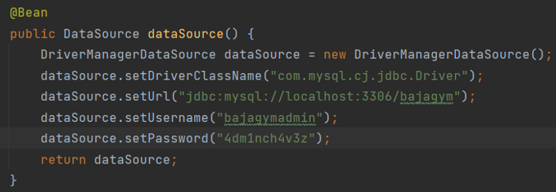
  
  Esta clase irá en la configuración del servicio interno también.
- Instalar jdk en la VM para poder ejecutar las aplicaciones mediante el jar de cada una de ellas.
  1. Se descarga el openJDK 8 headless (para no obtener un JDK completo)
     sudo apt install openjdk-8-headless
     
     
     
  2. Para poder usar java, tenemos que especificarle al SO el $JAVA_HOME (variable que guarda el path del jre).
  Esta variable se guardará en ~/.bashrc o en /etc/profile. Para guardar estas variables editamos esos archivos y añadimos:
    export JAVA_HOME="/path/to/jre" (suele instalarse en: "/usr/lib/jvm/java-8-openjdk-amd64/jre")
    export PATH=$PATH:$JAVA_HOME/bin
- Una vez configurada toda la VM, se procede a obtener el .jar de cada una de las aplicaciones.
    Para este apartado se obtendrá lo que se denomina como "fat jar" (jar con todas las dependencias).
    Se puede hacer de dos maneras mediante el IDE (en nuestro caso intelij, pero no recomendamos esta opción ya que nos causó problemas y no conseguimos obtener el .jar con todas las dependencias), o mediante Maven.
    Para hacerlo mediante Maven solamente hay que incluir en el pom.xml:
    
    1. 
    
    2. 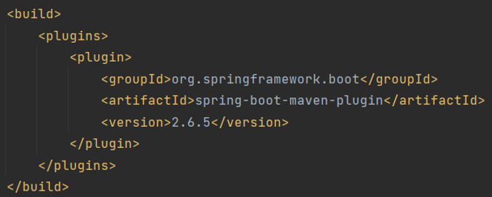
  
  Una vez introducidas las dependencias, se actualiza el proyecto Maven y en el proyecto maven clickamos primero sobre clean y luego sobre install.
       
  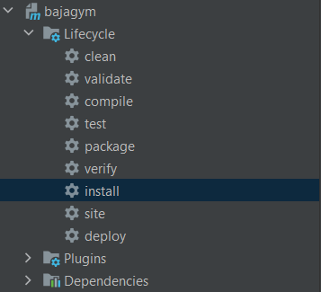
  
  Todo este proceso se repite para el servicio interno y ya tendriamos nuestros .jar.
- Por útlimo, solo queda ejecutar el comando java -jar "nombreJar.jar" con el jar de la app y del servicio interno y ya estaría la aplicación y el servicio desplegados y listos para peticiones.

